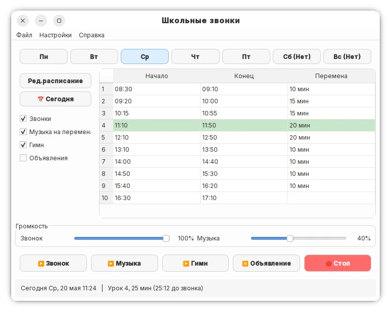

# 🔔 School Bell / Школьные звонки

Автоматизация школьных звонков с гибким расписанием, стабильными сигналами звонков, музыкой на переменах, гимном и объявлениями.



## ✨ Возможности

- **Автоматические звонки** — начало и конец уроков по расписанию
- **Музыка на переменах** — случайный трек через 2 мин после звонка, без повторов в день
- **Гимн и объявления** — отдельные настройки и запуск по расписанию
- **Светлая тема** — оформление в стиле GNOME Adwaita
- **Умный редактор** — длительность урока с авто-расчётом окончания, перемены 5–30 мин
- **Гибкое расписание** — обычное, сокращённое или пустое для каждого дня
- **Два языка** — русский и английский

## 🚀 Быстрый старт

### Установка в одну команду

```bash
pip install PySide6 pyyaml && git clone https://github.com/otetswoo/python_schoolbell.git && cd school_bell && python school_bell.py
```

Если уже скачали:

```bash
pip install PySide6 pyyaml && python school_bell.py
```

## 📁 Структура

```
school_bell/
├── school_bell.py       # Главное приложение
├── src/                 # Модули
│   ├── config.py        # Константы и настройки по умолчанию
│   ├── config_manager.py # Управление настройками (YAML)
│   ├── sound_player.py  # Воспроизведение звуков звонков
│   ├── music_player.py  # Музыка на переменах (без повторов)
│   ├── lesson_dialog.py # Диалог добавления/редактирования урока
│   ├── schedule_editor_dialog.py # Редактор расписания
│   ├── music_settings_dialog.py # Выбор папки с музыкой
│   └── anthem_settings_dialog.py # Настройки гимна
├── schedule.yml         # Расписание звонков
├── preferences.yml      # Пользовательские настройки
├── sounds/              # Звуки звонков (начало/конец урока)
├── music/               # Музыка для перемен
└── logs/                # Логи работы
```

## ⚙️ Настройка

### Музыка на переменах

1. Создайте папку `music/` (или любую другую с музыкой)
2. Положите аудиофайлы (`.mp3`, `.wav`, `.ogg`, `.flac`, `.m4a`)
3. **Настройки → Музыка на переменах** → выберите папку через проводник
4. **Настройки → Мелодии звонков...** → задайте файлы «на урок» и «с урока» в одном окне

Музыка играет через 2 минуты после звонка на перемену. Треки не повторяются в течение дня.

> 💡 **Совет:** Создавайте тематические плейлисты в разных папках:
> - `music/patriotic/` — патриотическая музыка
> - `music/space/` — тема "Космос"
> - `music/classical/` — классическая музыка
> 
> Меняйте папку в настройках каждую неделю под текущую тему!

## 🌐 Язык

**Настройки → Language / Язык** → Русский / English

## 🔧 Горячие клавиши

| Клавиша | Действие |
|---------|----------|
| `Ctrl+O` | Загрузить расписание |
| `Ctrl+S` | Сохранить расписание |
| `Ctrl+T` | Сегодня |
| `Ctrl+Q` | Выход |

## 🚀 Автозапуск при включении компьютера

Программа должна запускаться автоматически при старте системы.
Самый надёжный способ — добавить её в автозапуск рабочего стола.

### XFCE4 (Альт Образование, Xubuntu и др.)

Параметры → Сеанс и запуск → Автозапуск приложений → добавить:
- Имя: School Bell
- Команда: `/usr/local/bin/school-bell`
  (или: `python3 /путь/к/school_bell.py`)

Либо вручную создать файл `~/.config/autostart/school-bell.desktop`:
```ini
[Desktop Entry]
Type=Application
Name=School Bell
Exec=/usr/local/bin/school-bell
Hidden=false
X-GNOME-Autostart-enabled=true
X-GNOME-Autostart-Delay=5
```
Задержка 5 секунд нужна чтобы звуковая система успела инициализироваться.

### GNOME / MATE / LXQt

Создайте файл `~/.config/autostart/school-bell.desktop`
с содержимым выше — работает во всех этих оболочках одинаково.

---

## 🔒 Блокировка экрана для защиты от посторонних

Если компьютер со звонками стоит в доступном месте (ресепшн, коридор),
рекомендуется настроить автоблокировку экрана.

### XFCE4

Параметры → Экранная заставка:
- Включить экранную заставку: ✅
- Блокировать экран: ✅
- Задержка: 3–5 минут

Или через терминал:
```bash
xfconf-query -c xfce4-screensaver \
    -p /lock/enabled -s true --create -t bool
xfconf-query -c xfce4-screensaver \
    -p /lock/sleep-activation/delay-minutes \
    -s 5 --create -t int
```

### Другие оболочки

Установите `xautolock` и добавьте в автозапуск:
```bash
xautolock -time 5 -locker xflock4
```

> 💡 **Совет:** Создайте отдельную учётку специально для School Bell
> (например `zvonki`) с паролем известным только администратору.
> Настройте автовход в эту учётку — тогда при включении компьютера
> сразу запустится School Bell, а посторонние не смогут
> разблокировать экран не зная пароля.

## 📄 Лицензия

MIT

---
